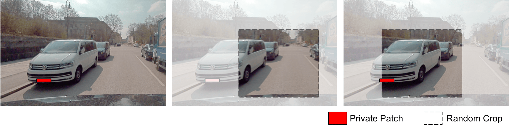

# Amplified Patch-Level Differential Privacy for Free via Random Cropping

<p align="left">


This is the official implementation of our TMLR paper.

["Amplified Patch-Level Differential Privacy for Free via Random Cropping"](https://openreview.net/forum?id=pSWuUF8AVP)

Kaan Durmaz, Jan Schuchardt, Sebastian Schmidt, Stephan Günnemann.

## Requirements
To install the requirements, execute:
```bash
uv venv --python 3.11
source .venv/bin/activate
uv pip install -r requirements.txt
```

## Installation
You can install this package via `uv pip install -e .`

## Usage
In order to reproduce all experiments, you will need to execute the scripts in `seml/scripts` using the config files provided in `seml/configs` using the [SLURM Experiment Management Library](https://github.com/TUM-DAML/seml).  

After computing all results, you can use the scripts in `plotting` to recreate the figures from the paper.  

## Cite
Please cite our paper if you use this code in your own work:
```
@article{
durmaz2025amplified,
title={Amplified Patch-Level Differential Privacy for Free via
Random Cropping},
author={Kaan Durmaz and Jan Schuchardt and Sebastian Schmidt and
Stephan G{\"u}nnemann},
journal={Transactions on Machine Learning Research},
year={2025},
url={https://openreview.net/forum?id=pSWuUF8AVP}
}
```